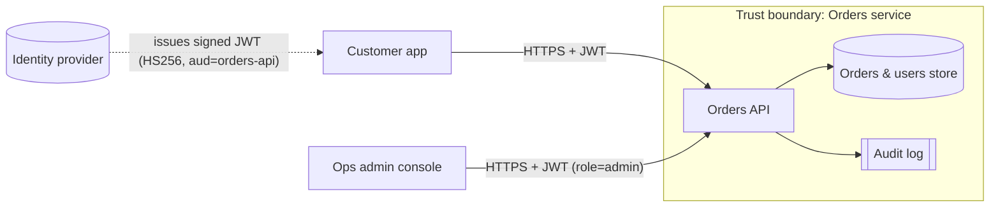

# Threat Model: Orders API

**Method:** STRIDE per element on a data-flow diagram, risk rated Likelihood × Impact (1–3 each).
**Scope:** customer-facing Orders API (`api/secure_app.py`), its token validation and data store. The identity provider itself is out of scope and treated as trusted.
**Author:** Beatrice Mwangi (Certified Threat Modeling Professional). This is a lab system, not a real product.

## 1. Data-flow diagram

Trust boundaries: **internet → Orders API** (all input is untrusted) and **API → data store** (the API is the only writer).

## 2. Assets

| Asset | Why it matters |
|---|---|
| Customer orders (item, price, status) | Financial integrity, privacy |
| User records (email, password hash, role) | Account takeover, privacy (GDPR) |
| Signing secret for JWTs | Anyone holding it can mint admin tokens |
| Service availability | Revenue, SLA |

## 3. Threats, controls and evidence

| ID | STRIDE | Threat | OWASP API 2023 | L×I | Control in code | Test evidence |
|---|---|---|---|---|---|---|
| T1 | Spoofing | Attacker sends unsigned `alg=none` token to impersonate any user | API2 | 3×3 | Algorithm pinned to HS256; signature always verified | `test_T1_*` |
| T2 | Spoofing | Expired, wrong-audience, wrong-issuer or forged tokens accepted | API2 | 2×3 | `exp`, `aud`, `iss`, `sub`, `iat` required and checked; random secret if none configured | `test_T2_*` |
| T3 | Info disclosure / Tampering | User reads or edits another user's order by changing the ID (BOLA) | API1 | 3×3 | Owner check on every object access; 404 for both "not yours" and "doesn't exist" | `test_T3_*` |
| T4 | Info disclosure | API returns internal fields such as `password_hash` | API3 | 2×3 | Explicit response models (allow-list of fields) | `test_T4_*` |
| T5 | Tampering | Client sets `price` or `status` through PATCH (mass assignment) | API3 | 3×2 | Write model allows only `note`; unknown fields rejected (422) | `test_T5_*` |
| T6 | Elevation of privilege | Customer calls admin-only delete endpoint | API5 | 2×3 | Role check dependency on all `/admin` routes | `test_T6_*` |
| T7 | Info disclosure | Stack traces reveal paths, versions, secrets | API8 | 2×2 | Global exception handler returns generic 500; docs UI disabled | Code review |
| T8 | Denial of service | Huge page sizes or request floods exhaust the service | API4 | 2×2 | `limit` capped at 50; 20 req/10 s per subject → 429 | `test_T8_*` |
| T9 | Repudiation | Admin deletes an order and denies it | – | 1×2 | Planned: structured audit log of admin actions (subject, action, object, time) | Not yet implemented |

## 4. Residual risks and next steps

- **T9 audit logging** is designed but not implemented; it is listed so the gap stays visible.
- The in-memory rate limiter protects one instance; a multi-instance deployment needs a shared limiter (API gateway or Redis).
- HS256 uses a shared secret. With several services validating tokens, asymmetric keys (RS256/EdDSA with JWKS rotation) are safer, because verifiers never hold a signing key.
- Brute-force protection on the login endpoint belongs to the identity provider and should be reviewed separately.
