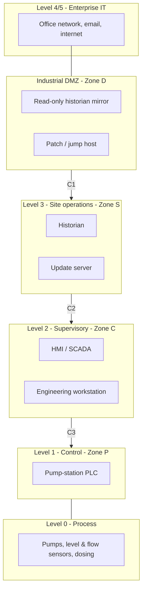

# IEC 62443 Zones & Conduits: Water Pumping Station (reference design)

A small reference segmentation model for a municipal pumping station, used to
derive the communication policy the Modbus monitor enforces
([`policy.yaml`](../policy.yaml)). It follows the IEC 62443 zone-and-conduit
method and the Purdue reference model. This is a teaching example, not a real
site.

## Purdue levels and zones

## Zones and target security levels

| Zone | Contents | Target SL | Rationale |
|---|---|---|---|
| P – Control | PLC (Level 1) | SL 3 | Direct control of the physical process; highest protection |
| C – Supervisory | HMI, engineering workstation (Level 2) | SL 2 | Human operators; compromise leads to control commands |
| S – Site operations | Historian, update server (Level 3) | SL 2 | Aggregates data; bridge to IT |
| D – Industrial DMZ | Historian mirror, jump host | SL 2 | The only path between IT and OT |

## Conduits (allowed communication paths)

| Conduit | Between | Allowed protocols/flows | Controls |
|---|---|---|---|
| C1 | DMZ ↔ Site ops | Historian replication, patch pull | One-way where possible; no direct IT→OT routing |
| C2 | Supervisory ↔ Control | **Modbus/TCP 502** — reads for all; writes only from HMI and engineering workstation | Enforced by [`policy.yaml`](../policy.yaml) and the monitor |
| C3 | Control ↔ Process | Hard-wired / fieldbus | Physical; out of scope for the network monitor |

**No conduit exists directly from enterprise IT (Level 4/5) to the control zone.**
The monitor's rule R1 (unknown host talking Modbus to the PLC) exists to detect
exactly that boundary being crossed, for example through a firewall
misconfiguration.

## Why monitor Modbus at all

Modbus/TCP has no authentication, no authorization and no integrity checking.
Any host with a network path to TCP/502 can issue read or write commands. In an
OT network the practical defence is layered:

1. **Segment** (zones and conduits, above) so few hosts can reach the PLC.
2. **Constrain** what those hosts may do (the policy: who may write, which
   registers, what value ranges).
3. **Monitor** the conduit passively and alert when traffic breaks the policy
   ([`detector/modbus_ids.py`](../detector/modbus_ids.py)) — a passive tap never
   interferes with the process.

## Mapping to IEC 62443-3-3 requirements (illustrative)

| Requirement | How this lab addresses it |
|---|---|
| SR 1.1/1.2 Identification & authentication | Compensated by host allow-listing on the conduit (Modbus itself has none) |
| SR 2.1 Authorization enforcement | Per-host allowed function codes in the policy |
| SR 3.1 Communication integrity | Value-range and function-code checks catch tampered/injected commands |
| SR 6.2 Continuous monitoring | The passive Modbus monitor and its alerts |
| SR 5.1 Network segmentation | Zone-and-conduit design above |
